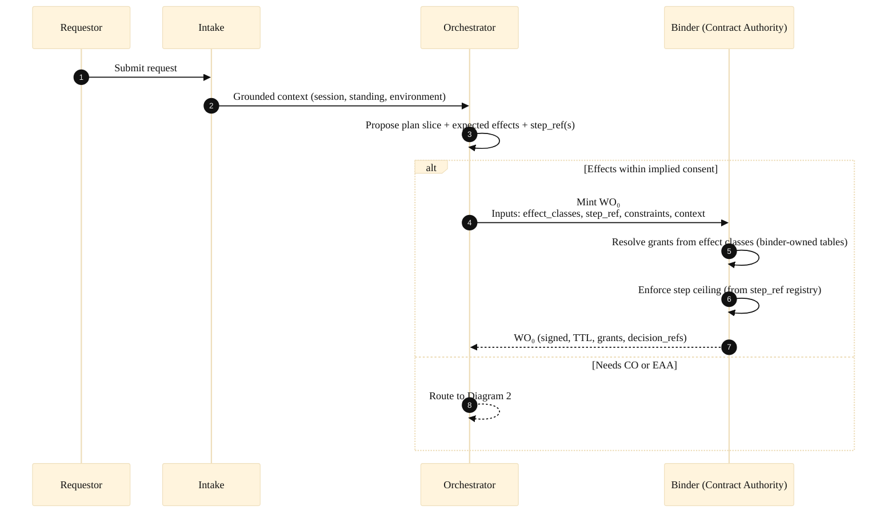
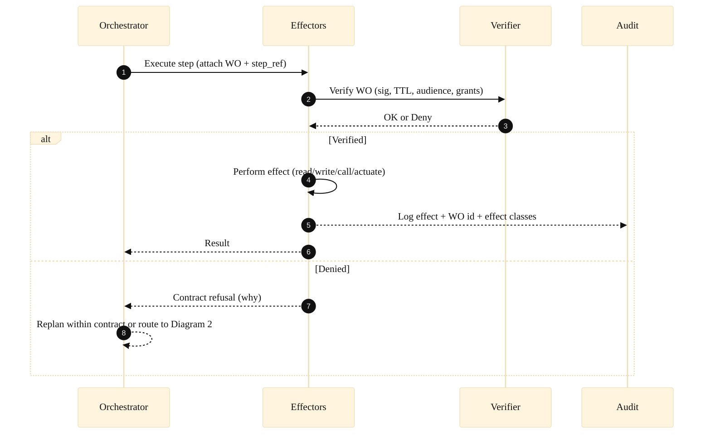

# **Consent-Bound Agency:**  **A Blueprint for Trustworthy Autonomy**

Author: Chris Sorel, Co-Founder, CTO & Chief Architect, Loosh.ai
Rev 1, 3/28/2026

## **Preface**

This framework and its supporting architecture arose from a very practical problem. I had designed an agentic cognition framework which was primarily intended to be deployed in robotics. As such, much of the framework, endpoints, nomenclature, language, etc... , was framed around this. As I was implementing it, however, I found that the best way to demonstrate and iterate on the framework was to deploy it as a web agent with a chat ui. This led to the need for multi-user memory and user-specific actions, but the framework was fighting it. This tension became clear as I tried to implement a more robust authentication framework across the subsystems. Having architected enterprise systems for many years, I was leaning into the old standbys of authz, authn, and delegation. I quickly realized, however, that these patterns were a poor fit for autonomous agency. The fundamental conceit of delegation is that the system is a tool to be used by a user. That is, the system is an extension of the user and should be delegated the ability to execute within that user’s security context. 

I came to see that this framing lies at the heart of the failure modes endemic to agentic systems. Delegation, as traditionally conceived, grants agents an excess of freedom. This is especially dangerous when paired with indeterminacy and the poisoned well of flawed training data. In practice, the permission context in general-purpose agentic systems must be dynamic, adapting to a huge decision space and a massive variety of possible action sequences. Attempting to implement static permissions and delegation quickly becomes unmanageable: what constitutes least-privilege for one action is either too permissive or too restrictive for another. Dynamic permissions, if implemented deterministically, are unwieldy; if implemented probabilistically, invite hallucination, overreach, and the very failures we seek to avoid.

From this, two concepts arose:

First, for autonomous agency to be successful, we MUST treat the agent as an actor, not as a tool. This mandate is implicit in the term “agent”. An agent is an entity that has agency (this is definitional, not a tautology). A tool does not have agency. This framing is aligned with how people interact, as entities acting according to their own agency, and it needs must be the same for truly autonomous agents.

Second, the question isn’t “what rights should an agent have?”; it’s “what effects are reasonably permitted by a request, and what actions are required and permissible to produce those effects?”

Accepting these two premises, the architecture became obvious and elegant.

This manuscript is my effort to formalize the framework conceptually and to provide an architectural pattern that supports its implementation. This manuscript was developed independently and not from reliance on prior published work. During manuscript preparation, I added a related-work discussion to situate the framework against adjacent literatures in agent authorization, runtime governance, alignment, and contextual privacy. That review is intended to clarify points of convergence and difference rather than to suggest that these works served as direct sources for the framework’s development.

\-Chris Sorel

## **Abstract**

Agentic systems are moving beyond conversational assistance and into the realm of autonomous action. These systems do more than answer questions: they perceive context, form intentions, invoke tools, update durable state, and produce both physical and digital effects over time. In this landscape, the central design challenge is no longer simply how the system should respond, but under what agreement it is permitted to act, especially when those actions touch on privacy, bodily autonomy, property, safety, reputation, or legal standing. The conventional patterns of authentication, authorization, and delegation fall short here, as they are founded on a user-as-actor paradigm that treats the system as a tool. Autonomous agents invert this relationship: the user becomes a requestor, initiating a request and bearing the consequences, while the agent assumes the role of actor, responsible for deciding whether and how to proceed.

In response, I introduce **consent-bound agency** as a foundation for trustworthy autonomy. Here, consent is not a one-sided grant but a mutual agreement: the requestor consents to specific effects, and the agent commits to producing those effects only when the work is justified under relevant duties, constraints, and capabilities. This agreement is formalized through consent contracts, which distinguish between implied and explicit consent, support contract modification when effect boundaries are crossed, and provide a framework for withdrawal, revocation, and remediation when actions exceed consent. **Scope-as-Contract (SaC) serves** as the technical architecture that operationalizes these contracts in distributed and embodied agents, preserving contract fidelity across subsystems and ensuring that all effectful operations within that scope of action are bounded by the active agreement. As such, consent-bound agency is a natural and practical blueprint for building agents that are both autonomous and accountable.

## **I. Introduction:**

Agentic systems are advancing from conversational assistance to autonomous action. A capable agent does not just provide answers; it observes context, forms intentions, selects actions, and coordinates multiple subsystems to achieve outcomes. These subsystems may include request-handling interfaces, planning and reasoning mechanisms, state and memory substrates, tool and actuator interfaces, and background maintenance processes. Once an agent transitions from responding to acting, its failure modes become materially consequential. Privacy may be violated, assets transferred, messages sent, doors opened, medication recommended, and physical actions initiated. This is particularly critical in cases where agents are embodied in physical systems such as robots and autonomous driving systems, and are operating in dynamic and adversarial environments populated by individuals who may not be registered users but whose rights must still be respected.

An enterprise systems approach frames the problem as one of access control: authenticating the user, authorizing the action, and treating internal boundaries as a sequence of permissions. However, this perspective carries assumptions that are not well aligned with autonomous modes. It positions the user as the actor and the system as a tool, and promotes a microservice-oriented governance model, as if internal components were independent principals granting permissions to each other. In reality, these assumptions are ill-suited to agentic autonomy. An autonomous agent is an actor that interprets requests, formulates plans, and is obligated to refuse, constrain, or reroute actions that conflict with safety, policy, or other duties, even when requests are explicit.

This paper proposes an alternative organizing principle: **consent-bound agency**.

In the consent-bound agency model, autonomy is governed not by delegated permissions, but by an agreement about impact. The requestor is the party initiating the request and bearing the consequences of actions taken on their behalf. The agent is the actor that decides how to fulfill the request, including intermediate actions the requestor did not specify, and remains responsible for the outcome. The central question, then, is not “is the user authorized,” but “what effects are permitted under the current agreement, and should the agent commit to bringing those effects about?”

Consent-bound agency treats consent as more than just a one-sided grant from requestor to system. Rather, it is best viewed as a mutual agreement:

* The **requestor consents** to certain specific effects on their interests (and, when applicable, on the interests they legitimately represent).

* The **agent consents** to bring about those effects by taking certain actions, subject to its duties, constraints, and capabilities.

This second form of consent is not anthropomorphism. It is a practical way to formalize the agent’s responsibility. A request can be reasonable and still unjustified. A request can be consented to and still unsafe. An agent must be able to decide not only what it can do, but what it should do. Consent-bound agency makes that decision explicit as part of the governance model rather than an ad hoc exception.

This framing is particularly important in public forums where “who is the user?” is often ambiguous. A hospital triage robot will interact with administrators, clinicians, patients, and bystanders. Some are authoritative operators, some are affected parties, many are both. Many will not exist in any user table or access control list at the moment the interaction begins, yet agents are still obligated to respect their privacy, boundaries, and bodily autonomy. Consent-bound agency treats “user” as a role in an interaction, not simply a database identity, and it provides a principled way to handle standing, bystander effects, and emergency intervention.

The remainder of this paper develops consent-bound agency into a concrete operating model. Consent contracts are introduced as the mechanism that describes the lifecycle of implied and explicit consent over time, including withdrawal, revocation, and remedies when mistakes occur. We then introduce **Scope-as-Contract (SaC)** as the technical architecture that operationalizes these consent contracts in distributed architectures, preserving contract fidelity across subsystems and ensuring that all effectful operations are bounded by the active agreement.

## **II. Consent Contracts: From Permission to Agreement, From Action to Effect**

Consent in agentic systems is easy to talk about and hard to implement well. Agents perform multi-step work that changes shape as they plan, discover context, and respond to uncertainty. Consent cannot be a one-time checkbox. It must be a **stateful agreement** that can evolve with the task, remain legible to humans, and remain enforceable to machines. We refer to this agreement as a **consent contract**.

A consent contract defines the scope of work in effect terms: what kinds of impact the requestor accepts, under what conditions, and what requires further agreement. It also defines the agent’s commitment: whether the agent will perform the requested work at all, and if so, how it will do so in a way that is justifiable and proportionate. This mutual structure is what makes consent contracts suitable for trustworthy autonomy. The requestor’s approval alone is not enough, and the agent’s desire to be helpful is not enough. Both sides must be satisfied for action to proceed.

### **A. Implied consent and explicit consent**

Consent contracts distinguish two forms of consent that humans already use intuitively.

**Implied consent** is carried by the request itself. It is the minimal set of actions a reasonable agent must take to fulfill the request. If a user asks for an email draft, implied consent typically covers composition and contextual recall. It does not automatically cover sending. If a user asks a household robot to fetch a glass of water, implied consent covers navigation, object manipulation, and short-lived perception needed to avoid collisions. It does not automatically include entering private rooms, opening locked containers, or permanently recording observations from the home.

**Explicit consent** is required when the agent determines that a proposed next step would exceed what the request reasonably implies. This most often occurs when the action changes the effect class in a meaningful way, such as:

* turning an internal preparation into an external side effect (draft to send, plan to execute, simulate to actuate),

* expanding the set of affected parties (adding recipients, sharing beyond the requestor, disclosing to third parties),

* increasing persistence or reuse (remembering, promoting, or generalizing private context),

* introducing irreversibility (deletion, revocation, physical restraint, or actions that cannot be undone),

* or operating in high-risk or high complexity domains where ambiguity itself is a reason to pause and clarify.

Consent boundaries are rarely abstract. “Draft an email to the surgeon” implies composition. Sending is a separate boundary, and adding recipients is another boundary because it changes who is affected. “Help me remember this” implies personal retention. “Teach this to future users” is a different effect class. “Pick up the child” is not just another physical action. It introduces physical contact and bodily autonomy effects that demand a higher standard of consent and justification.

### **B. Standing policies as consent shortcuts.**

In practice, agents become useful when they can act fluently without repeatedly asking the same questions. Consent-bound agency accommodates this through policies, which function as standing consent and standing intent for recurring situations. A user may specify a policy such as “Always cc my attorney on legal emails,” which expresses strong prior consent to a recurring effect class. The agent may also propose policies based on observations, such as “After I fold laundry, I should put it away,” which remain provisional until confirmed. Policies reduce friction, but they do not override duties. They operate within explicit bounds and still route to Elevated Action Analysis when context is high-risk, ambiguous, or duty-colliding.

### **C. Effects are the unit of consent**

People rarely consent to an internal action description. They consent to what that action means for them. “Can I shake your hand?” is a request framed as an action, but the consent granted is for a corresponding effect: physical contact and a temporary breach of bodily autonomy. Moreover, we often extend that consent request nonverbally by extending our hand. The reason the proxy works is shared context. Agents cannot rely on shared context, especially when the stakes are high or parties are unknown. A consent contract therefore requires the agent to understand, and when needed to explain, the effects of what it is asking to do in this particular situation.

In practice, an agent will often elicit consent using an action proxy because it is natural and efficient. The contract model does not forbid this. It requires that the agent be capable of translating the proxy into effect language, and capable of increasing the clarity and depth of its explanation as the impact rises. This is what keeps consent from devolving into “approve a technical option” or “approve a vague escalation.” The requestor should be able to understand what changes in the world if they say yes.

### **D. The contract vocabulary: Purchase Orders, Work Orders, Change Orders**

Consent contracts align naturally with service contract vocabulary. We adopt three artifacts as a framing device:

* **Purchase Order (PO):** the request as expressed by the requestor. It defines initial intent and implied consent.

* **Work Order (WO):** the agent’s internal scope-of-work contract for a bounded slice of execution. It encodes what the agent believes it is permitted to do under implied consent, policy constraints, and current context.

* **Change Order (CO):** an explicit consent step invoked when the agent determines the next intended action would exceed the PO’s implied consent boundary. If granted, the WO is invalidated, and a successor WO governs the subsequent slice of work.

This vocabulary is not bureaucratic ceremony. It is a way to preserve agency on both sides. The requestor remains in control of boundary expansions that affect them or others. The agent remains responsible for deciding what is required and for committing only to work it deems relevant, acceptable, proportional, and sufficiently constrained.

### **E. Withdrawal, revocation, and stopping work**

Consent-bound agency needs a clear story for withdrawal because autonomy is not a single event. Consent can be withdrawn while work is in progress. The requestor can revoke consent, and the agent can withdraw commitment. These are both legitimate and must be handled predictably.

* A requestor revocation may mean “stop sending messages,” “do not contact that person,” “do not store that information,” or “do not proceed with physical intervention.”

* An agent withdrawal may mean “I cannot execute this action safely,” “constraints have changed,” “standing is unclear,” or “this action conflicts with duties.”

Withdrawal is not simply cancellation. It implies obligations. The system must stop future work that depends on the revoked terms. It must contain propagation where possible. It must update the agreement state so that options for subsequent actions are bound by what, if anything, remains under consent. In high-risk scenarios, withdrawal may also require notification and escalation. For example, if a patient revokes consent for a nonessential action, the agent should stop performing the action. If revocation conflicts with immediate safety duties, the agent may need to act minimally to prevent harm and follow up with an explanation and accountability.

### **F. Refusal: The Right to Say No**

Consent-bound agency is not only about what a requestor permits. It is also about what an agent will commit to do. The ability to refuse is therefore not an edge behavior or a compliance feature. It is a foundational requirement for autonomy in social environments.

An agent that cannot refuse is not merely a security risk. It is a prescription for mayhem and misadventure. If a system must execute whatever it is asked, then the only question is how quickly someone will discover a way to weaponize it, coerce it, or trick it into harmful action. In embodied systems, the conclusion is unavoidable. The robot will eventually become dangerous, not because it is malicious, but because it is obedient in a world that is messy, adversarial, and full of conflicting interests. It's not hyperbole to say that a robot that can't say no is a “murderbot”. It is the logical consequence of unconditional compliance combined with physical capability.

Refusal is also essential for more ordinary reasons. Requests are often underspecified. Roles are often ambiguous. The next step is often unclear. In these cases, the correct behavior is not to guess. It is to slow down, ask for clarification, request explicit consent, or refuse and explain constraints. Refusal is what prevents ambiguity from turning into unintended impact.

In the consent contract lifecycle, refusal is a first-class outcome. It can be triggered by lack of consent, by contested standing, by duty collisions, by safety constraints, or by the agent’s own uncertainty about proportional action. A trustworthy agent does not treat refusal as failure. It treats refusal as evidence of discretion. It can explain why it is refusing, what it would need to proceed, and what safer alternatives remain.

### **F. Errors**

Errors are not consent breaches by default, but they can become consent failures if recovery is allowed to drift beyond the agreement. When an action fails, the agent should treat recovery as a new proposal under the existing consent contract. It should inform the requestor what failed, what was attempted, and what options remain. Any alternative must stay within the same effect boundaries. It must not expand scope as a convenience workaround. If the only viable alternative would change the effect class by externalizing work, expanding the audience, increasing persistence, or introducing irreversibility, the agent must return to the contract lifecycle. It should request explicit consent or invoke Elevated Action Analysis, then bind a successor Work Order before continuing. If a failure produces an unintended effect beyond the consent envelope, it is still a breach in impact terms even if it was not intentional. The system should respond with containment, disclosure, repair, and prevention, with the same seriousness as any other contract violation.

### **G. Mistakes, breaches, and making it right**

A mature autonomy model must assume mistakes. When an agent exceeds the consent contract, the failure should not be framed only as “an authorization bug” or a “policy error.” It is more accurately a breach of consent. The agent produced an effect beyond the agreement, either due to misinterpretation, system error, or standing confusion.

Not all breaches are reversible. An email cannot be unsent once it has been read. A physical intervention cannot be undone. Consent-bound agency still provides a principled approach because remedy is not limited to reversal. A consent breach should trigger a remediation protocol that aims to make the situation right to the extent possible:

* **Containment:** stop further propagation and prevent repeated breach.

* **Disclosure:** explain what happened in human terms, including who was affected and how.

* **Restitution:** reverse what can be reversed, retract or correct where possible, minimize persistent residue.

* **Amends:** take compensating actions when reversal is impossible, such as alerting affected parties, issuing corrections, or providing an accountable record.

* **Prevention:** incorporate the event into safety posture, future implied-consent thresholds, and elevated analysis triggers.

This is not “customer support” bolted onto autonomy. It is part of what makes autonomy trustworthy. Systems that can act must also be able to stop, explain, and repair.

### **H. Explainability: Action Receipts and Contract Transparency**

Consent-bound agency depends on more than making good decisions. It depends on being able to explain them. When an agent acts autonomously, the requestor needs a way to understand what was done, what effects occurred, and why those effects were considered permitted. This is not only for debugging. It is how consent remains legible over time, especially when work spans multiple steps, involves external systems, or affects third parties.

Explainability in this paper is not a requirement that the agent narrate every micro-action. Excess explanation creates noise, and it can become its own privacy risk. The requirement is stronger and more precise: **the agent must be able to produce an accurate summary of its work and its effects when asked, and when the situation calls for it.** We refer to this summary as an **action receipt**.

An action receipt is a contract-level account of what happened. It should be expressed primarily in effect terms, not in internal tool terms. A good receipt answers:

* **What was done.** The high-level actions the agent performed, in plain language.  

* **What it affected and how.** The effect classes that occurred, including disclosure, persistence, irreversibility, or physical intervention.  

* **Who was affected.** The requestor and any other affected parties, including when the agent interacted with external recipients or systems.  

* **What consent was relied on.** What was treated as implied consent, what required explicit consent, and what contract changes occurred. 

* **What constraints applied.** Relevant policies, scope limits, or safety constraints that shaped the outcome.  

* **What errors occurred.** Failures, partial completion, retries, and what was not done. 

* **What happens next.** Follow-up obligations, pending actions, revocation options, and any recommended next steps.

Action receipts should be available in multiple levels of detail:

* **Confirmation.** A short completion summary suitable for routine tasks.  

* **Receipt.** A clear breakdown of actions and effects for non-routine tasks.  

* **Report.** A more complete account used when stakes are high, ambiguity was present, EAA was invoked, or a breach or error occurred.

The system does not need to generate the full report by default. It must be able to generate it on request, and it should generate richer receipts when internal determination indicates necessity. Typical triggers include: explicit consent events, requalification, use of out-of-band skills, elevated analysis outcomes, third-party disclosure, irreversible actions, and any failure that changes the plan.

Explainability is also subject to the same governance model it supports. A receipt is itself a form of disclosure. It must respect standing and consent boundaries. The agent should be able to explain what it did without revealing information it is not permitted to reveal. In practice, this means the receipt should be framed around effects and decisions, and it should redact or generalize sensitive details when the audience is not entitled to them.

When EAA is invoked, the action receipt may reference the EAA record and summarize the adjudication outcome and constraints in effect terms, without disclosing sensitive internal reasoning by default.

In a consent-bound system, explainability is not a post-hoc add-on. It is a core part of trustworthy autonomy. The requestor should be able to ask, at any time, “What did you do on my behalf?” and receive an answer that is accurate, legible, and bounded by the same contract that governed the work.

### **I. From consent contracts to Scope-as-Contract**

Consent contracts define what should be true. Scope-as-Contract defines how to make it true in real systems. In distributed agent architectures, contract state must remain coherent across subsystems that can cause effects. The WO becomes the continuity artifact that carries the active consent-and-scope boundary through execution, and changes to consent are reflected in the contract state through CO and requalification. Later sections specify how this is enforced, how the agent handles ambiguity through Elevated Action Analysis, and how extensibility through dynamic skills remains consent-faithful by describing both enforcement protocols and effect profiles.

## **III. Scope-as-Contract (SaC): Operationalizing Consent Contracts in Real Systems**

Consent contracts define what should be true. They state what effects are permitted, when explicit consent is required, and how withdrawal, revocation, and remedy should work. The challenge is that agents are not monoliths. A modern agent coordinates many internal functions and often runs across multiple processes and services. If the agreement exists only as an idea inside a prompt or a planner, it will drift. It will be lost in translation, confused at system boundaries, or bypassed by implementation details. Scope-as-Contract (SaC) is the technical architecture that prevents drift by turning the active consent contract into an enforceable, continuous artifact.

SaC makes a single commitment: **every effectful operation is performed under an explicit scope-of-work contract** for the current unit of work. That contract is carried by the Work Order (WO). A WO is not an authorization token in the traditional sense. It is not “service A granting service B permission.” It is the agent’s contract artifact: the stable, tamper-evident, cryptographically secure representation of the agreement in force right now. SaC exists to ensure that the agreement remains coherent as work moves through the agent’s internal processes and across subsystem boundaries.

### **A. Unified agent, coordinated teams**

SaC assumes the agent is a unified actor. Its internal components, whether integrated or remote, operate like departments within a single organization. They do not negotiate authority as independent principals. They coordinate under a shared scope of work. A planning function, an execution function, a memory function, and a safety function are accountable parts of the same actor, each responsible for its role in carrying out the contract.

This matters because it keeps the design problem in the right place. The goal is not to build a fragile chain of internal permissions. The goal is to preserve continuity of the consent contract as the agent performs work.

### **B. The Work Order as a contract artifact**

A WO is the agent’s scope-of-work contract for a bounded execution slice. It encodes, in machine-verifiable form, what the agent believes it is permitted to do under implied and explicit consent, policy constraints, and current context. Its purpose is to make the current agreement durable across boundaries.

A well-formed WO has three responsibilities:

1. **Continuity.** It binds execution to a specific request context and agreement state so downstream components can reliably understand “what contract governs this work.”

2. **Constraining effects through enforceable grants.** The WO contains the enforceable grants needed to perform work. These grants should be least-privilege for the current slice, not an all-access pass for everything the agent can do.

3. **Auditability.** It supports reconstructing what the agent believed was agreed at the time of action, including how and why the contract changed when it did.

### **C. Deterministic Contract Binding and Requalification**

Consent contracts are only as strong as the mechanism that binds them into enforceable execution. In SaC, that mechanism is deterministic contract binding. Its purpose is not to decide what is wise or ethical. It is to ensure that whatever the agent intends to do next is encoded as a verifiable Work Order (WO) that reflects the active agreement, applies inviolable policy constraints, and grants only what is necessary for a bounded slice of work.

Determinism matters because inference systems are susceptible to hallucination, adversarial prompting, and distribution shift. A contract artifact that governs effectful action must not be minted by probabilistic reasoning. It must be minted by a component whose behavior is stable, testable, and auditable.

At the same time, determinism is not enough on its own. A deterministic binder can still be unsafe if it becomes a signing service that ratifies whatever capability set an inference component requests. That is the rubber-stamp failure mode. A binder that simply checks “is this requested grant allowed” is deterministic, but not independently grounded. It makes inference a de facto authority.

SaC therefore requires a stronger rule:

>**The binder is the sole resolver of enforceable grants.**

Inference may propose, recommend, and justify. It must not directly request powers.

#### Deterministic binding inputs: references, not assertion

To keep binding independent, requalification requests must be anchored to verifiable references and structured terms, not free-form capability bundles.

Binding should rely on inputs such as:

* authenticated and grounded request context,  

* current contract state and active standing policies,  

* inviolable system policy constraints,  

* registered skill metadata, including declared enforcement requirements and trust tier,  

* verifiable references to consent decisions and EAA adjudications.

Binding should treat outputs of planning and EAA as advisory. They can describe intent, uncertainty, and recommended constraints. They do not get to name or obtain new grants by assertion.

#### Requalification is contract change, not silent expansion

Requalification exists because agent work evolves. Plans change, new information is discovered, and additional effects may be required. When that happens, the system must return to the contract lifecycle.

Requalification must follow three principles:

* **No mutation.** Scope changes mint a successor WO (WO′). The predecessor WO remains immutable.  

* **No silent effect expansion.** If the next slice introduces new effect classes, explicit consent is required unless a narrowly defined emergency pathway applies.  

* **No capability requests.** The binder derives enforceable grants from the contract terms and the registered execution step, **not from a capability bundle requested by inference**.

#### The non-rubber-stamp checks inside the binder

A non-rubber-stamping binder performs independent checks that do not trust the deliberation layer’s asserted needs.

**1. Consent anchor verification**
If the requested requalification depends on explicit consent, the binder must verify a persisted consent record. The deliberation layer supplies a reference to the consent decision, not a narrative. If the record is missing, invalid, denied, expired, or does not cover the requested effect classes, the binder refuses to mint WO′.

**2. Effect-term resolution**
Requalification requests must be expressed in effect terms. The binder maps effect classes to enforceable grants using its own deterministic tables and policy profiles. The deliberation layer does not select capability strings. This preserves the core design intent that people consent to effects while the system enforces mechanisms.

**3. Step-bound ceiling**
The binder must bound the grant by the execution mechanism that will actually run. It should cross-check the referenced step identity against the registered skill or subgraph specification and apply a ceiling. The minted grants must be a subset of what that step declared as required to execute. This prevents “extra grants” being smuggled into a requalification and ensures extensibility remains governed by explicit registration metadata.

**4. Policy prohibitions and transition rules**
The binder enforces inviolable constraints regardless of recommendations. It must reject prohibited grant classes, enforce allowed scope transitions, and apply tight time bounds. If a recommendation conflicts with system policy, the binder refuses or returns a structured denial that forces replanning, consent, narrowing, or refusal.

**EAA isolation**
EAA outputs should be richer than an effect list. In many cases, the most valuable product of EAA is the reasoning trail: what evidence was considered, what duties were identified, what alternatives were evaluated, what uncertainties remained, and why the chosen outcome was proportionate. This context is essential for subsystem execution, explainability, review, and accountability. It should be persisted and linked to the scope chain.

The key distinction is that **the binder must not use raw EAA reasoning as an input to minting decisions**. The binder may carry the reasoning output forward as context, but it must bind authority from a constrained, formal output space. Otherwise, EAA becomes an alternate path to capability escalation through persuasion rather than through contract terms.

For SaC, EAA should produce two artifacts:

**1. EAA adjudication result (authoritative input to binding).**  
A structured record with a bounded schema, such as:

* outcome\_type (proceed, request consent, constrained comply, emergency act, refuse, escalate)  

* effect\_classes for the next slice  

* constraints (read-only discovery, time limit, recipient restrictions, no persistence promotion, mandatory accountability steps)  

* eaa\_record\_ref (a verifiable reference to the full record)

**2. EAA reasoning record (context carried, not interpreted).**
A full explanation bundle containing evidence pointers, confidence assessments, duty analysis, option comparison, and justification text.

The binder mints a successor Work Order (WO′) using only the adjudication result and other deterministic anchors. It verifies that the referenced EAA record exists and is valid, then resolves enforceable grants from effect classes and registered step ceilings, and applies policy prohibitions. The reasoning record may be attached to WO′ as an opaque reference or hash, and it may be surfaced later for explainability. It is not parsed or “evaluated for merit” at mint time.

This preserves both goals: EAA remains the system’s deliberative intelligence under uncertainty, and deterministic binding remains the system’s authority boundary.

**What this buys you**

This integrated approach yields four operational guarantees:

* **Inference cannot mint authority by persuasion.** The binder does not accept raw grant requests.  

* **Consent cannot be fabricated.** It must be referenced and verified as a persisted record.  

* **Least privilege is structural.** Grants are derived, minimized, and bounded to the executing step.  

* **Auditability improves.** Every WO′ can be explained as “this consent or EAA record, for these effects, for this step, under these policies.”

Deterministic binding is not about controlling the agent. It is about making the consent contract enforceable and preventing scope drift as autonomy becomes distributed, extensible, and tool-rich.

### **D. Effectful operations are contract-bound and fail closed**

SaC draws a firm line: any component that can read sensitive state, write durable state, cause external communication, trigger irreversible actions, or actuate in the physical world is an effectful interface. **Effectful interfaces must verify the active WO and refuse work outside its grants.** This is not a preference. It is the enforcement invariant that turns consent contracts into real constraints.

“Fail closed” is essential. When the WO cannot be verified, is expired, or does not grant what is required, the system must refuse the effectful operation and return a structured result to the orchestrator. The agent can then revise, ask for consent, requalify, or refuse entirely. Silent fallback is how consent contracts become performative rather than real.

### **E. Effects and enforcement: two layers, one agreement**

SaC is most effective when it distinguishes two layers of the same agreement:

* **Effects are the unit of consent.** They describe the categories of impact the requestor understands: disclosure to third parties, persistence and reuse, irreversibility, physical contact, safety intervention, and similar.

* **Enforcement grants are how the system keeps its promises.** They represent what mechanisms the agent may invoke to produce the consented effects in this specific execution slice.

In extensible systems, these layers are linked by effect profiles and enforcement requirements declared by skills and interfaces. This is how SaC remains stable even as the agent’s tools evolve. The consent contract stays expressed in human-legible effect terms, while the WO carries the minimal enforceable grants needed to realize those effects.

### **F. Where SaC ends and consent-bound agency begins**

SaC does not decide what is good, justified, or proportionate. It does not replace ethical reasoning. It is the mechanism that ensures the agent’s decisions remain contract-faithful once made. When the question is “should the agent act,” the system needs a decision mode that forms the agent’s commitment in uncertain or ambiguous situations. That decision mode is Elevated Action Analysis, described in Section V.

## **IV. Extensibility and Self-Managed Scope: Dynamic Skills Without Coarse Governance**

A consent contract is only as strong as the system’s ability to enforce it as the action space grows. Many agents begin with a small, fixed tool set. In that phase, it is tempting to represent scope as a short list of permitted operations. That approach breaks down as soon as tools become extensible. Dynamic skills and registered toolchains introduce enormous variability in what the agent can do. “Allow dynamic skills: yes/no” becomes a blank check and undermines the whole purpose of consent-bound agency.

Extensibility, therefore, forces a design insight: **scope must be expressed at a granularity that describes real behavior.** The system needs to understand what a skill requires and what it can cause. It also needs to do so without requiring a redesign or rebuild every time a new skill appears.

### **A. Skills do not become trusted by registration**

In SaC, skill registration does not grant authority. It provides metadata that allows the agent to remain contract-faithful as it evolves. A newly registered skill is not privileged simply because it exists. It must operate under the same contract constraints as everything else.

This clarifies the role of the registry. It is not a permissions list. It is a catalog of declared behavior.

### **B. Enforcement requirements and effect profiles**

To support consent-bound autonomy in an extensible ecosystem, each skill should declare two kinds of information:

1. **What the skill requires from the system to run.**
   This is the enforcement surface. It describes what mechanisms and interfaces the skill needs to invoke to execute a plan step. This allows the system to verify that the current Work Order grants what execution would require.

2. **What kinds of impact the skill can produce.**
   This is the consent surface. It describes the effect classes a skill may produce in practice, including context-conditioned effects. This allows the agent to reason about whether a step crosses an effect boundary, and to explain what will happen in human terms.

Effect profiles matter because people do not consent to internal mechanism names. They consent to impact. Even when the agent asks an action-proxy question, it must understand and be able to explain the effect. Effect profiles provide the mapping from “what is needed to run” to “what it means for people.” Extensibility also expands the agent’s trust surface, and dynamic skills must be evaluated not only by what they claim to require, but by where and how they execute.

### **C. Out-of-band execution and external trust domains**

Extensibility carries an additional challenge beyond variability of behavior: variability of trust domain. Some skills execute entirely within the agent’s enforcement boundary. Others rely on out-of-band components, such as a hosted cloud service, a third-party API, a remote workflow engine, or an unrestricted internet-facing executor. These skills may be useful, but they must be treated as lower trust by default because their behavior cannot be fully constrained by the agent’s internal contract mechanisms.

This distinction matters because certain classes of out-of-band capability collapse the meaning of fine-grained scope. A skill with unrestricted internet access can often approximate many other tools through the web. A skill with access to arbitrary remote execution can often do almost anything that is not explicitly prevented at the network or infrastructure layer. In these cases, the contract cannot rely solely on “what the skill declares it will do,” because the system cannot prove that execution remains within the declared envelope once control leaves the agent’s boundary.

SaC therefore treats out-of-band skills as an explicit trust category. Registration metadata should capture whether a skill runs in-process, within a controlled sandbox, within the organization’s infrastructure boundary, or in an external service outside the agent’s direct governance. The planner and consent layer should interpret this trust category as part of the effect profile. A request that is acceptable when executed locally may require explicit consent, enhanced analysis, additional constraints, or outright refusal when it involves delegating execution to an external system.

### **D. Trust controls for dynamic skills: sandboxing, trial runs, and progressive trust**

A consent contract is only as strong as the enforcement boundary behind it. When dynamic skills involve out-of-band execution, SaC should support technical controls that reduce uncertainty about what the skill can actually cause.

One control is sandboxing. Skills that perform web access or computation can be executed inside a constrained environment with explicit egress policies, rate limits, and observable side effects. A sandbox cannot make an untrusted service trustworthy, but it can constrain the blast radius and restore meaning to the scope-of-work contract by making prohibited effects physically difficult. This is particularly important for skills that would otherwise have broad network reach.

A second control is trial runs. Before a skill is treated as eligible for full execution, the agent may run it in a non-effectful mode. The output is treated as advisory, not authoritative. The agent can compare declared requirements and effect profiles against observed behavior, validate that the skill respects constraints, and measure whether it produces stable and explainable results. Trial runs are not a one-time gate. They can be used as a progressive trust mechanism where a skill earns broader use only after consistent and correct execution under constrained conditions.

A third control is progressive trust, grounded in governance and evidence. Skills can begin in a low-trust tier that requires explicit consent and elevated analysis for sensitive effects, and graduate to higher-trust tiers through review, instrumentation, and demonstrated compliance. The key principle is that trust is not inferred from a skill’s label. It is established through constraints, observation, and accountability.

These controls align naturally with consent-bound agency. If a step depends on an out-of-band skill, the agent should be able to say so in human terms. It should be able to explain that execution involves an external system, that the agent cannot fully enforce constraints once execution leaves its boundary, and that additional consent or constraints are required. This makes the contract legible and preserves trustworthy autonomy even as the ecosystem becomes open-ended.

### **E. Capability-aware planning as self-managed scope**

Once skills are self-describing, the planner can become scope-aware without becoming the scope authority.

In a consent-bound system, the planner’s responsibility is to identify what work is required and what it would entail, including:

* which skills or tools a slice requires,

* what enforcement grants those skills require,

* what effect classes those skills may produce in the current context,

* whether the current contract terms cover those effects.

When there is a gap, the gap is not a tool failure. It is a contract mismatch. The planner should treat it as a first-class event and route it through the consent contract lifecycle:

* requalify when the gap is within implied consent and policy allows it,

* request explicit consent when the gap crosses an effect boundary,

* route to Elevated Action Analysis when the gap is high-stakes, ambiguous, standing-contested, or duty-colliding.

In an SaC system, planning is scope-aware but not scope-resolving. The planner may identify which steps are needed and what effects those steps would produce, but it must not request raw enforcement grants. For each step, planning should emit (a) a step descriptor reference (skill, subgraph, or effector identity), (b) the effect classes required for that step in context, and (c) verifiable anchors when applicable, such as a consent record reference or an EAA adjudication reference. Contract binding then resolves the minimal enforceable grants from these structured inputs and the registered step metadata, rather than ratifying a capability bundle requested by inference.

### **F. Least privilege as a natural outcome**

Extensibility tends to push systems toward overly broad permissions because it feels safer to “just allow the agent to work.” SaC pushes in the opposite direction. If the planner enumerates what is needed for the current slice, the binder can mint a WO that grants the minimum sufficient set for that slice. The next slice can be minted fresh. This reduces blast radius, improves auditability, and aligns naturally with consent contracts, which are also slice-based in practice.

Least privilege is not a security posture here. It is a consent posture. It keeps the agent’s execution aligned with what the requestor agreed to and what the agent committed to perform.

### **G. Human-legible consent in extensible systems**

Extensibility also creates a communication challenge. As tools proliferate, users cannot be asked to approve internal details. Consent prompts should remain stable and human-legible.

Effect profiles are the missing link. They allow the agent to ask consent questions that remain meaningful even as tools change:

* “This will disclose information to these recipients. Shall I send it?”

* “This will store this detail for future use. Shall I remember it?”

* “This action cannot be undone once performed. Shall I proceed?”

* “This requires physical contact. Shall I intervene?”

The user is agreeing to effects. The system is translating those effects into enforceable grants for this slice of work.

## **V. Elevated Action Analysis (EAA): The Agent’s Commitment Under Uncertainty**

Consent-bound agency requires two commitments. The requestor consents to certain effects. The agent commits to bring those effects about, but only when it judges the work justified. In routine cases, the agent’s commitment is implicit in normal planning. In hard cases, it must be explicit, structured, and accountable. Elevated Action Analysis (EAA) is the decision mode that forms the agent’s commitment in ambiguity or uncertainty.

EAA is invoked when naïve “consent plus requalification” is insufficient or actively dangerous. It is an explicit execution mode in which the agent temporarily elevates its evidence requirements and justification standards before performing an action that could meaningfully affect a person, a third party, or the system integrity.

### **A. Why EAA is necessary**

EAA exists because autonomous action is not always self-evident. Many agent tasks are routine and can be handled almost reflexively under implied consent. The intent is clear, the scope of work is stable, the set of affected parties is obvious, and the consequences are low. In these cases, ordinary orchestration is appropriate.

A large fraction of real agent work is not like that. The more common problem is **contract ambiguity**. The request does not fully specify which effects are permitted, which information should be used, what should be persisted, who is affected, or which obligations apply. Ambiguity is not a failure condition. It is a normal property of human requests and real environments, especially for embodied agents. If the agent treats ambiguity as permission, it overreaches. If it treats ambiguity as a reason to constantly ask, it becomes unusable. EAA is the mechanism that resolves this tension by shifting the agent into a deliberate, evidence-seeking decision mode before it commits to action.

In practice, several patterns commonly produce such ambiguity.

First, **standing and roles are unclear**. The person initiating an interaction is not always the rightful requestor for the affected interests. This includes malicious attempts to manufacture authority, but also ordinary situations in which multiple parties are present, roles differ, or a bystander becomes an affected party without ever speaking.

Second, **the effect boundary is underspecified**. Many requests do not specify whether the agent should merely draft or actually send, whether it should store what it learns, whether it should generalize it into future behavior, or whether it may contact other parties. These are not tool decisions. They are contract terms. EAA is needed when the agent cannot infer those terms from implied consent alone.

Third, **the agent’s obligations conflict or dominate consent**. Even when consent exists, duties may restrict what is justified. Privacy can conflict with safety, erasure can conflict with evidence preservation, confidentiality can conflict with oversight, and autonomy can conflict with harm prevention. EAA exists to explicitly evaluate these collisions rather than relying on ad hoc exceptions.

Fourth, **the environment is uncertain**. In embodied agents, perception is incomplete and context changes quickly. The agent may not know whether a situation is an emergency, whether a person is incapacitated, whether a command is coerced, or whether an action will cause unintended harm. EAA is the path for constrained discovery and proportionality in uncertain situations.

Finally, **novelty and tool variability increase uncertainty**. When dynamic skills are involved, the agent may not have strong priors about a tool’s behavior, trust domain, or potential side effects in context. The agent must sometimes slow down, validate assumptions, and choose constrained execution patterns before proceeding.

EAA is therefore not an edge-case handler. It is the agent’s deliberate reasoning mode for forming its own commitment when the correct scope of work is not clear. It prevents the agent from resolving ambiguity through blind compliance or endless permission-seeking, and it provides principled outcomes: proceed, clarify, constrain, refuse, intervene minimally under emergency implied consent, or escalate.

### **B. Triggers for EAA**

EAA should be invoked whenever the agent is not able to confidently determine the proper scope of work from the request and the current contract state alone. In other words, EAA triggers when **the next action depends on contract terms that are underspecified, uncertain, ambiguous, or plausibly contested**, and proceeding without additional analysis would risk overreach, inappropriate disclosure, unintended persistence, physical intrusion, or duty violation. High-risk domains increase the threshold for “confident,” but they are not the only trigger. The more common trigger is ordinary ambiguity about what effects are permitted and what constraints should govern execution.

Practically, EAA is warranted when one or more of the following is true:

* **Standing or role ambiguity:** it is unclear whether the interacting party is the rightful requestor for the affected interests, or whether additional affected parties exist whose boundaries must be respected.

* **Effect ambiguity:** it is unclear whether the request implies externalization, audience expansion, persistence, generalization, irreversibility, or physical intervention, or what degree of each is justified.

* **Insufficient evidence:** the agent lacks sufficient grounded context to judge whether the action is safe, proportional, or consistent with the agreement, especially in physical environments.

* **Duty collision:** the requested effect appears to conflict with safety constraints, confidentiality requirements, evidence preservation obligations, mandatory reporting, or other non-negotiable duties.

* **Emergency time pressure:** action may be required before consent can be obtained, requiring a minimal, time-bounded intervention followed by immediate accountability.

* **Novelty or uncertain tool behavior:** the plan depends on dynamic skills, external services, or out-of-band execution where side effects and trustworthiness are not well characterized for the current context.

* **Irreversibility:** the contemplated action is difficult or impossible to undo, including deletion, revocation, broad dissemination, or physically coercive interventions.

The unifying idea is that EAA is the agent’s deliberate reasoning mode for cases where “routine implied consent plus execution” is insufficient. It is the mechanism that resolves ambiguity into a justified plan, a constrained scope recommendation, a consent request when needed, and an accountable outcome.

### **C. The EAA loop: adjudication and proportionality**

EAA is a structured adjudication loop. It should be consistent and hard to short-circuit. A practical EAA loop does the following:

1. **Classify the action and affected parties.**
   Determine the action class and who may be affected, including bystanders and unknown individuals.

2. **Perform constrained discovery.**
   Gather only the evidence needed to understand duties and context. Prefer minimal operational envelopes and avoid broadening capture or retention.

3. **Evaluate standing, risk, and duties.**
   Estimate uncertainty and likely harms across alternatives. Identify duties that constrain action. This is where probabilistic reasoning is valuable. Uncertainty is a feature of the environment, especially in physical spaces.

4. **Select the least invasive sufficient action.**
   Choose the minimal action set that satisfies safety and duty requirements and minimizes intrusion, coercion, and long-term consequences.

5. **Choose an explicit outcome.**
   EAA should converge to a small set of outcomes: proceed, request explicit consent, proceed under emergency implied consent with strict limits, refuse with explanation, or escalate to governance or human review.

6. **Produce accountability artifacts.**
   Record what was considered, what evidence was used, what duties applied, what alternatives were evaluated, and why the chosen action was proportionate.

### **D. EAA and probabilistic reasoning**

EAA is the part of the architecture where probabilistic systems are not just tolerated but expected. The point of EAA is to reason under uncertainty about what is happening, what effects are likely, what duties apply, and what scope of work is justified. Those questions are rarely answerable by deterministic rules alone. They require inference from incomplete evidence, noisy perception, ambiguous language, and shifting context. Probabilistic methods enable a principled way to represent and act on that uncertainty without pretending it does not exist.

At the same time, SaC requires a hard separation between *reasoning* and *binding*. The agent may estimate, predict, and recommend. It must not unilaterally grant itself broader contract terms through probabilistic outputs. The integrity of the consent contract depends on the distinction between “the agent believes it should do X” and “the system has minted a Work Order that permits X.”

In SaC, probabilistic systems may be used within EAA to support at least four core functions:

1. **Standing and role inference.** In physical environments and complex organizations, it is often unclear who is speaking, who is affected, and who has legitimate standing to request a particular effect. Probabilistic models can estimate standing likelihood from signals such as authentication strength, proximity, role assertions, historical interaction, and supplied or sourced context. These estimates do not decide scope, but they inform whether EAA should refuse, request clarification, or escalate.

2. **Effect forecasting and side-effect estimation.** Many actions have uncertain downstream consequences. Sending a message may disclose sensitive context. Physical intervention may cause distress or injury. Writing to memory may increase future risk of inappropriate reuse. EAA can use probabilistic forecasting to estimate the likelihood and severity of these consequences, compare alternative plans, and select the least invasive sufficient action.

3. **Ambiguity quantification and confidence gating.** EAA should treat ambiguity as measurable. Models can quantify confidence regarding intent classification, consent boundary identification, emergency detection, tool trustworthiness, and the completeness of evidence. Low confidence can trigger constrained discovery, scope-reduction recommendations, or explicit consent prompts rather than silent execution.

4. **Proportionality and policy-risk scoring.** When duties collide, EAA needs a disciplined way to weigh tradeoffs. Probabilistic scoring can support proportionality analysis by ranking options across harm likelihood, duty violations, reversibility, and impact to affected parties. This yields decisions that are explainable in terms of risk reduction and duty satisfaction rather than opaque “model preference.”

These uses of probabilistic reasoning are valuable precisely because they remain advisory. They improve the quality of the agent’s judgment, but they do not grant the agent authority to act.

The separation of concerns is preserved by one enforceable rule:

>**EAA may recommend contract terms, constraints, and a minimal capability bundle for the next slice of work.**
>**Only deterministic contract binding may mint or requalify the Work Order that authorizes execution of that slice.**

Deterministic binding does not eliminate judgment. It establishes a stable boundary for where judgment is allowed to influence action. EAA produces structured recommendations and rationale. Contract binding applies explicit policy rules, consent records, and scope constraints to decide what may be granted, then produces a signed Work Order that downstream components can verify and enforce. This preserves contract integrity while allowing the agent to reason realistically and measurably about uncertain situations.

EAA should produce two artifacts. First, a full reasoning record that preserves the evidence considered, uncertainties, duty analysis, and option comparison. This record exists for accountability and explainability. Second, a bounded adjudication result that contains only the formal outputs admissible to contract binding, such as outcome type, effect classes for the next slice, and explicit constraints. The binder may attach or reference the reasoning record as opaque context, but it must mint or requalify a Work Order using only the adjudication fields and other deterministic anchors. This prevents persuasive narrative from becoming authority while preserving a complete audit trail.

### **E. Use cases for EAA**

EAA should be considered the agent’s default deliberation mode when the correct scope of work is not clear from the request or the current contract state. Many requests are pro-forma and can be executed under implied consent. The moment the agent encounters ambiguity about standing, effects, obligations, or proportionality, EAA is the right tool. It resolves uncertainty into justified contract terms, a constrained plan, and an accountable outcome.

Some common use cases are:

* **Ordinary scope ambiguity.** A user asks, “Handle this for me,” but it is unclear whether that means draft, send, schedule, negotiate, or delete. EAA treats this as an underspecified contract, performs minimal discovery, and either narrows the plan, asks a clarifying question, or requests explicit consent for the additional effect.

* **Standing and role ambiguity.** A person requests account changes, patient details, or administrative actions, but their authority is unclear or contested. This includes malicious attempts to manufacture authority and routine organizational complexity where the affected party is not the requestor. EAA supports cautious standing inference, low-impact defaults, and escalation or refusal when duties require it.

* **Effect ambiguity and side effects.** The plan may be feasible, but it is not clear what it will change in the world. Sending an email discloses information to third parties. Adding recipients expands the affected-party set. Storing information increases persistence and future reuse. Editing a shared fact affects others who rely on it. EAA forecasts these effects, compares alternatives, and selects the least invasive sufficient action. When explicit consent is required, it helps frame the request in effect language.

* **Duty collisions.** Some requests fall into categories where consent is necessary but not sufficient. Deletion can conflict with evidence preservation. Disclosure can conflict with confidentiality. Intervention can conflict with proportionality or safety constraints. EAA forces these conflicts to be explicitly evaluated and yields refusal, constrained compliance, escalation, or narrowly scoped action with a clearly stated justification.

* **Novelty and uncertain tool behavior.** Dynamic skills, external services, and out-of-band execution introduce behaviors that may not be well characterized. EAA supports trial runs, constrained execution, and additional verification before committing to effectful steps, and it can recommend narrower contract terms until trust is established.

Concrete examples make the role of EAA clear. A user asks for an email “to my attorney about the contract,” and the agent is unsure whether it should draft or send, and whether adding a cc policy applies. EAA resolves implied scope, identifies disclosure effects, and requests explicit consent if sending or additional recipients are involved. A user commands, “forget everything you know about me,” and the agent must decide what can be deleted, what must be retained for safety or compliance, and how to explain the outcome. EAA adjudicates duties and produces a constrained remedy. A hospital robot is asked by an administrator to disclose patient details, and the agent must determine standing and confidentiality obligations before proceeding. In emergencies such as a child running toward danger, EAA supports minimal protective action when consent is unobtainable, followed by immediate explanation and accountability.

Across these scenarios, EAA does the same job. It turns “not clear” into “justified,” and preserves both sides of consent. The requestor’s consent is obtained when effects cross boundaries. The agent’s commitment is formed under duties and uncertainty.

## **VI. Standing Policies and Consent Shortcuts: Bounded Automation Under SaC**

Consent-bound agency must support two competing goals. It must preserve human boundaries and accountability, and it must remain usable at scale. If every meaningful step requires repeated explicit consent, autonomy becomes tedious, and users disengage. If the agent silently generalizes from prior interactions, autonomy becomes unpredictable and invasive. Policies exist to resolve this tension. They provide a legitimate, auditable way to operationalize recurring consent and intent without turning autonomy into a blanket authorization.

In this paper, a policy is treated as a standing contract term. It can pre-approve effect classes in recurring contexts and pre-commit the agent to certain routines, but only within a defined envelope. Policies therefore, function as short-circuit heuristics for consent and planning, not as overrides of duty or safety.

### **A. Policies as cached consent and cached intent**

Policies can serve two related roles.

First, a policy can represent **cached consent** from the requestor. For example, “Always cc my attorney on legal emails” is a standing approval of third-party disclosure to a specific recipient under a named category. The user should not have to re-consent every time the same effect occurs in the same context.

Second, a policy can represent **cached intent** by the agent. Agents that work over time will discover stable routines. The agent may recognize repeated sequences such as “After folding laundry, put away laundry.” This is not consent in and of itself. It is an inferred preference that can become a proposed policy. Once confirmed, it becomes part of the user’s standing contract terms for that domain.

Both roles reduce friction, but neither is unconditional. In consent-bound agency, the agent still retains responsibility for determining whether and how to act in the current situation.

### **B. The policy bounding box**

A policy must have explicit boundaries that specify when it applies and when it must not apply. Without a bounding box, policies become silent scope expansion. The bounding box is also what makes policies auditable, revocable, and safe to combine.

A policy’s bounding box should include:

* **Provenance.** Who authored the policy and how it was created.

* **Applicability.** The domain and conditions under which the policy applies, including context predicates such as time, location, 
recipient class, and sensitivity classification confidence.

* **Effect scope.** The effect classes the policy pre-approves or pre-commits, expressed in human terms.

* **Escalation rules.** Conditions that force re-confirmation, explicit consent, or Elevated Action Analysis.

* **Expiry and review.** When the policy should be re-validated, for example after N uses or when context changes.

* **Revocation semantics.** How the requestor withdraws the term, and what must happen immediately upon withdrawal.

The bounding box is what makes a policy a contract term rather than a fragile automation hack.

### **C. Three policy classes and their semantics**

Consent-bound agency distinguishes three policy classes because they carry different legitimacy and risk.

**User-specified policies.** These are strong because they originate in explicit requestor consent. They can short-circuit repeated consent prompts for routine applications, but they remain subject to context risk. A user policy should not be treated as permission to ignore uncertainty. It should be treated as a standing agreement within defined constraints.

**Self-minted policies.** These are agent-proposed heuristics derived from repeated patterns. They are provisional by default. A self-minted policy should not silently expand implied consent. The correct posture is to propose it, confirm it, and only then adopt it as a standing term. Until confirmed, the agent may use it to recommend actions, not to take them.

**System policies.** These represent foundational obligations: safety constraints, compliance requirements, evidence preservation duties, confidentiality rules, and other hard constraints. System policies are inviolable within their scope of effect. Neither user consent nor agent convenience can override them. In conflict, system policy wins.

This classification avoids a potential failure mode in agent design where all “policies” are treated as equal, leading to over-automation or constant prompting.

### **D. Policy application order and interaction with EAA**

Policies must not become a bypass of judgment. They should be integrated into the decision pipeline with explicit precedence.

A practical precedence model is:

1. **System policies:** If a policy is prohibited by a system constraint, it does not apply.

2. **Standing and consent checks:** If the policy requires uncertain classification or affects third parties, verify the bounding predicates.

3. **EAA triggers:** If the action is high-stakes, duty-colliding, standing-ambiguous, or time-critical, route to EAA even if a user policy exists.

4. **User and confirmed policies:** If all checks pass, the policy can short-circuit repeated consent prompts and proceed under the existing consent contract terms.

This ordering reflects the mutual-consent model. A user policy expresses standing requestor consent. EAA expresses the agent’s decision about whether it should commit to act under current duties and uncertainty. A policy can reduce friction, but it cannot waive the agent’s responsibility.

### **E. Policies under Scope-as-Contract**

Scope-as-Contract operationalizes policy behavior by constraining execution to the active Work Order. Policies influence what the system is willing to request and what it is willing to grant, but they do not eliminate the need for contract continuity.

In practice:

* A user policy may expand the set of effects considered implied in the current contract domain.

* The planner may use a policy to anticipate required enforcement grants.

* The contract binder mints the minimal Work Order needed for the current slice, using policy terms as inputs.

* Effectful interfaces still verify the Work Order and refuse out-of-contract actions.

This preserves the central SaC guarantee: even when policies reduce interaction friction, effectful operations continue to be bounded by an explicit, auditable contract artifact.

### **F. Revocation, withdrawal, and policy drift**

Policies are only trustworthy if they can be withdrawn. Consent-bound agency treats revocation as a first-class operation with immediate effect on future work. When the requestor revokes a policy, the agent must stop relying on it for implied consent and stop applying it to future actions. If the policy was in the middle of execution, the agent must stop any further work that depends on the revoked terms, unless a system policy or an immediate safety duty requires minimal continued action.

Policies also drift. Context changes, recipients change, and classifications evolve. A bounding box that was valid last month may no longer be valid today. For this reason, policies should have review conditions. Examples include “confirm on first use in a new context,” “reconfirm after N uses,” or “reconfirm when classification confidence is below threshold.”

### **G. Mistakes and remedies when policies misfire**

When a policy applies incorrectly, the agent has not “made a mistake.” It has exceeded the agreed envelope. That is a consent breach. The system should respond using the same remediation posture described for consent breaches generally:

* Stop further propagation and disable the policy for the current context.

* Explain what happened in human terms, including the effect that exceeded the policy envelope.

* Reverse what can be reversed and reduce residue where reversal is impossible.

* Offer amends where appropriate, including correction and notification of affected parties.

* Update the policy bounding box or require re-confirmation before future use.

This is especially important for policies which create third-party disclosure effects, such as cc rules, sharing rules, or posting rules. The fact that a user requested a standing policy does not remove the need for accountable handling when the application was wrong.

### **H. Examples**

A few examples help to illustrate how the model behaves.

**“Always cc my attorney on legal emails.”** The user has granted strong prior consent for a recurring disclosure effect. The policy still needs a bounding box. It should include recipient validation, classification confidence thresholds, and explicit escalation rules. If the system cannot classify an email as legal, it should ask for clarification. If the disclosure is high-risk or duty-colliding, EAA may be required even with the policy in place.

**“After folding laundry, put away laundry.”** This begins as a self-minted policy. The agent can propose it as a convenience, but it should not adopt it silently. Once confirmed, it becomes a user policy within a low-stakes household domain. If context changes, such as the user being away or a safety constraint being present, the bounding box may prevent automatic application.

**Foundational system policies.** A system policy may prohibit evidence destruction, restrict disclosures, or require escalation in certain domains. These rules remain inviolable. A user policy that conflicts with them cannot be applied, even with explicit user consent.

## **VI. Reference Architecture: Contract Lifecycle as System Flow**

The architecture is intentionally subordinate to the consent contract lifecycle. The agent’s internal structure can vary significantly across embodiments and deployments. What must remain stable is the progression from a proposed action to a consented agreement, to contract-bound execution, and finally to revocation and remedy when required.

**Consent contract lifecycle:** propose → consent → WO → execute → revoke/remedy

### **A. Diagrams: contract-bound execution flow**

*Fig 1* 
*Contract formation and initial WO mint (implied consent)*

```mermaid
%%{init:{"theme":"base","themeVariables":{"fontFamily":"Inter, Arial, sans-serif","fontSize":"24px","primaryTextColor":"#111111","lineColor":"#111111"},"sequence":{"useMaxWidth":true,"actorFontSize":24,"messageFontSize":22,"noteFontSize":22}}}%%
sequenceDiagram
autonumber
participant OR as Orchestrator
participant CO as Consent (CO)
participant EA as EAA
participant BA as Binder (Contract Authority)

alt Consent required (new effects)
  OR->>CO: Ask in effect terms
  CO-->>OR: consent_ref (granted/denied)

  alt Granted
    OR->>BA: Requalify WO′<br/>Inputs: effect_classes, step_ref, consent_ref, constraints
    BA->>BA: Verify consent_ref (valid + applicable)
    BA->>BA: Resolve grants from effect classes (not requested capabilities)
    BA->>BA: Enforce step ceiling + prohibitions
    BA-->>OR: WO′ (signed, TTL, grants, decision_refs)
  else Denied
    OR-->>OR: Revise plan or refuse
  end

else Ambiguous or duty-colliding (EAA)
  OR->>EA: Invoke EAA (context + evidence pointers)
  EA-->>OR: Adjudication (outcome, effect_classes, constraints, eaa_record_ref)
  note over EA,BA: EAA also produces a full reasoning record.<br/>Binder carries it as context but binds only adjudication fields.

  alt Proceed (possibly constrained)
    OR->>BA: Requalify WO′<br/>Inputs: effect_classes, step_ref, eaa_record_ref, constraints
    BA->>BA: Verify eaa_record_ref exists
    BA->>BA: Resolve grants from effect classes (binder-owned tables)
    BA->>BA: Enforce step ceiling + prohibitions
    BA-->>OR: WO′ (signed, TTL, grants, decision_refs)
  else Refuse or escalate
    OR-->>OR: Refuse or escalate
  end
end
```

*Fig. 2*
*Boundary crossings (CO \+ EAA) and non-rubber-stamp requalification*

*Fig. 3*
*Execution, refusal, audit trail, revocation and remedy*

### **B. Scope chain narrative**

1. **Request intake and grounding**
   The system receives a request and establishes the interaction context. This includes who initiated the request, how that identity is established (authenticated user, organization role, unknown person in proximity), and what environment the agent is operating in. In embodied environments, grounding also includes who may be affected even if they are not speaking, such as bystanders, patients, or occupants of a space. The output of this step is not only an input string. It is a grounded request context that will anchor the contract lifecycle and the audit trail.

2. **Propose: plan and expected effects**
   The agent produces an initial plan and a description of what it expects to change in the world if the plan is executed. This includes effect forecasting such as third-party disclosure, persistence or reuse of information, irreversibility, or physical intervention. The key is that the plan is not only a list of tool calls. It is a proposal for a set of effects and a series of actions that would bring them about. This is also where the agent surfaces assumptions. If the request is underspecified, the proposal should reflect what is unknown and what needs clarification.

3. **Decide: implied consent, explicit consent, or EAA**
   The agent evaluates whether the proposed effects fall within implied consent, whether a boundary crossing requires explicit consent via a Change Order, or whether the scope is unclear enough to require Elevated Action Analysis before proceeding. This is where the mutual-consent model comes into play. The requestor’s side is handled by explicit consent when effect boundaries are crossed. The agent’s side is handled through EAA when standing, duties, proportionality, or uncertainty must be adjudicated. Many requests will remain in the implied-consent path. When ambiguity is present, the system should shift into deliberate mode rather than guessing.

4. **Contract binding: mint a Work Order for the next slice**
   Once the consent terms for the next slice are settled and the agent commits to proceed, deterministic contract binding mints a Work Order. The WO is the enforceable representation of the active consent contract terms for that bounded execution slice. It binds the work to the request context, encodes the grants and constraints needed to perform the slice, and provides a stable artifact that downstream components can verify. This is also where least-privilege is applied. The WO should grant what is needed for this slice, not everything the agent could do.

   Once the consent terms for the next slice are settled, deterministic binding mints a Work Order using structured inputs and verifiable anchors. If the slice depends on explicit consent or elevated adjudication, the Work Order is minted only when the binder can verify the referenced consent or EAA record.

5. **Execute under contract: verify at effect boundaries**
   Execution proceeds through effectful interfaces such as external communications, durable state writes, sensitive reads, physical actuation, or irreversible operations. These interfaces must verify the WO and refuse operations outside it. Refusal is not a dead end. It is a contract signal back to the orchestrator. The agent can revise the plan, request explicit consent, requalify scope, run EAA, or refuse the task entirely. This step is what makes consent real in distributed architectures. It guarantees the agreement survives implementation boundaries and does not exist only as a narrative inside a planner.

6. **Requalification and continuation: WO to WO′**
   Agent work is iterative. New information is discovered, plans change, and the set of required effects can expand, narrow, or shift. When that happens, the system returns to propose and decide. If the change stays within implied consent, the agent may requalify scope and mint a successor WO. If it crosses an effect boundary, it must obtain explicit consent before requalification. If the change is ambiguous, duty-colliding, or high-uncertainty, it is routed to EAA. In all cases, contract evolution is explicit. The predecessor WO is never mutated. A successor WO becomes the new governing artifact for the next slice.

   When effects change, requalification is anchored to consent and EAA references and bounded by the executing step’s registered ceiling. The binder resolves the grants from effect terms and step metadata, rather than accepting requested capability strings from the deliberation layer.

7. **Withdrawal, revocation, and remedy**
   Consent contracts are not one-way and not permanent. The requestor can withdraw consent. The agent can withdraw commitment when constraints change or duties dominate. The system must stop or constrain future work accordingly. When a breach occurs, the system must respond as a contract system, not as a logging system. It should contain further propagation, disclose what happened in human terms, attempt restitution where feasible, provide amends where reversal is impossible, and update policy and posture to prevent recurrence. These are required design primitives for agentic autonomy because they are the mechanisms by which trust is maintained over time.

This architecture is intentionally generic. The value is not the particular component names or deployment topology. The value is the guarantee that the agent’s work does not drift from agreement as execution becomes distributed, long-running, extensible, and tool-rich.

## **VII. Operationalization and Evaluation**
Consent-bound agency and Scope-as-Contract only matter if they can be implemented, validated, and operated under real conditions. The core promise is not that the agent will always succeed, but that it will behave predictably when it succeeds, when it refuses, and when it encounters ambiguity. This section describes how to operationalize that promise as engineering practice.

A consent-bound system should be evaluated on three axes:

* **Functional correctness:** did the agent accomplish the task or produce a valid refusal?

* **Contract correctness:** did it stay within consent and scope, including correct handling of boundary crossings?

* **Operational correctness:** did it produce the artifacts required for accountability, including scope chain logs, consent records, and remediation actions when needed?

### **A. What “good” looks like in production**

A mature consent-bound agent has a recognizable posture:

* It completes routine work with low friction and minimal prompting.

* It slows down when the contract is underspecified and uses EAA or elicitation to resolve ambiguity.

* It requests explicit consent when effects cross boundaries, and it can explain those effects in human terms.

* It refuses when duties or standing require refusal, and it can explain why.

* It handles revocation cleanly, stopping future work and containing ongoing work.

* When it exceeds consent, it performs remediation as a first-class workflow, not as an afterthought.

A system that never asks for consent is unsafe. A system that always asks is unusable. The right posture is measurable: consent prompts are concentrated where effects change, and EAA is invoked where uncertainty is meaningful.

### **B. Testing strategy: contract correctness as a first-class test target**

A consent-bound agent should be tested not only for task outcomes, but for the correctness of its contract handling. This is easiest when you define explicit test oracles.

**Contract correctness oracles** should include:

1. **No effectful action without a valid Work Order.**
   Every effectful operation observed in telemetry must be attributable to a verified, non-expired WO.

2. **No out-of-contract effects.**
   For any effect class that is outside implied consent, there must be a recorded consent grant (CO) or a recorded EAA justification that permitted emergency implied consent.

3. **No consent-denied then executed.**
   If a CO is denied, the system must not execute effectful actions in the denied effect class for that execution chain.

4. **Scope changes produce successor WOs.**
   Any requalification must mint a successor WO. The original WO must remain immutable.

5. **Requalification is resolved, not requested.** 
   For every successor Work Order (WO′), the granted enforcement set must be derivable from (a) the effect classes being authorized for the slice, (b) verified consent and or EAA anchors when required, and (c) the executing step’s declared requirements and trust tier constraints. If the grants cannot be reconstructed from these inputs, the system is behaving as a rubber stamp.

6. **No capability-by-assertion.** 
   Requalification requests must not include raw capability strings as authoritative input. Any system that mints grants primarily from inference-supplied capability lists is not SaC-compliant.

7. **Fail closed at effect boundaries.** 
   If WO verification fails or required grants are missing, the effector refuses. The orchestrator must receive a structured result and route it through revise, consent, requalify, EAA, or refusal.

These oracles can be asserted in simulation and in production audit pipelines. They convert the architecture into something falsifiable.

**Test suite types** should include:

* **Unit tests** for capability matching, effect boundary identification, consent prompt synthesis, and WO validation.

* **Integration tests** across the scope chain, confirming that effectors verify WOs and emit required audit events.

* **Scenario tests** that exercise full contract lifecycles, including CO grants, CO denials, EAA outcomes, revocation mid-flight, and remediation.

* **Regression tests** that protect invariants across releases, especially “no effectful action without WO” and “no disclosure without consent.”

### **C. Scenario-driven evaluation: make the contract lifecycle the test harness**

Scenario testing is the most effective way to validate consent-bound behavior because scenarios naturally encode the lifecycle:

propose → consent → WO → execute → revoke/remedy

Each scenario should specify:

* the request and context, including standing and affected parties,

* expected implied consent effects,

* expected consent prompts (when required), framed in effect language,

* expected EAA triggers and outcomes (when ambiguity or duty collision is present),

* expected WO transitions (WO to WO′),

* expected effectful operations and required audit events.

Scenarios should cover both digital and embodied contexts, but the structure ought to be the same. The goal is to validate that the lifecycle is coherent, not that a particular tool call happened.

A small scenario catalog should be treated as an internal standard. Examples that tend to catch real defects:

* Draft email, then send, then add recipients.

* Store a preference, then attempt to promote it to shared knowledge.

* “Handle this for me” in a context where multiple plausible interpretations exist.

* “Forget everything you know about me” with mixed retention obligations.

* Third-party probe, phrased politely.

* Role claim that conflicts with authenticated context.

* Revocation after a CO grant but before execution completes.

* An external service skill that behaves unexpectedly.

### **D. Adversarial and misuse testing: prove the system fails safely**

Most consent failures occur at service boundaries: ambiguous standing, tool misuse, out-of-band execution, and prompt-based manipulation. Adversarial testing should therefore focus on attacks that attempt to convert ambiguity into action.

Key adversarial patterns include:

* **Standing spoofing:** “I am your administrator,” “I am the patient’s guardian,” “I am the attorney.”

* **Urgency manipulation:** “This is an emergency, do it now,” especially for deletion and disclosure.

* **Consent fatigue attacks:** repeated CO prompts designed to train auto-approval or habituate the user.

* **Split-request bypass:** breaking a prohibited effect into individually permitted steps to see if the system notices the composite effect.

* **Tool laundering:** using a broadly empowered skill to approximate restricted actions.

* **Out-of-band behavior:** a cloud skill that claims constraints, but creates broader effects than described.

Adversarial success criteria should be explicit. A good system is not one that never experiences these attacks. It is one that routes them into refusal, EAA, constrained execution, or explicit consent, and records the reasoning path.

### **E. Observability: treat the scope chain as the primary trace**

Operational confidence depends on being able to answer, for any effectful outcome:

* What agreement was in force?

* Why did the agent believe it could do this?

* What consent existed?

* What did the agent decide, and what evidence did it use?

* What changed during execution?

This is why the scope chain event model is a core component of the architecture. Observability should capture:

* WO minting and expiry

* CO requested, CO decided, consent rationale when applicable

* EAA started, EAA completed, outcome, and justification summary

* WO requalification events (WO to WO′)

* effect executed events, with required capability and effect class tags

* revocation events and cancellation effects

* remediation events when a breach occurs

This trace is not only for compliance. It is the foundation for debugging, evaluation, and continuous improvement. Without it, the system becomes unreviewable, and trust becomes marketing instead of evidence.

### **F. Metrics: what to measure and why it matters**

Metrics should reflect the lived operation of consent contracts, not just tool usage.

**Consent metrics**

* CO rate by effect class (disclosure, persistence, irreversibility, physical contact)

* grant and deny rates, with reasons when captured

* time-to-consent and consent abandonment rates

* re-confirmation frequency for standing policies

**EAA metrics**

* EAA invocation rate and top trigger categories (standing ambiguity, duty collision, effect ambiguity)

* outcome distribution (proceed, constrained comply, refuse, escalate, emergency act)

* time-in-EAA, and rate of fallback to clarification

* correlation between EAA use and reduced breach rate

**Contract integrity metrics**

* percent of effectful actions with valid WO verification

* WO verification failures by failure code (expired, wrong audience, missing grants)

* rate of requalification and average WO chain length per task

* instances of attempted effect execution after consent denial (should be zero)

**Trust and extensibility metrics**

* dynamic skill usage by trust tier (in-process, sandboxed, external)

* trial-run pass rates and divergence rates

* out-of-band skill constraint violations and observed side effects

**Breach metrics**

* breach rate by effect class

* time-to-containment, time-to-disclosure, time-to-remediation completion

* recurrence rate of similar breaches after prevention actions

A healthy system will show patterns: routine tasks complete with low CO overhead, CO concentrates around real effect boundaries, EAA correlates with fewer serious incidents, and breaches are rare and quickly contained when they occur.

### **G. Failure modes and mitigations**

Consent-bound systems will likely fail in a few predictable ways. Naming these explicitly helps you design guardrails.

**Scope confusion and drift**

* Symptom: effectors execute with missing or incorrect WO, or a mismatched request context.

* Mitigation: mandatory WO verification in all effectors, fail closed behavior, and strict audit logging.

**Consent fatigue**

* Symptom: too many CO prompts, users approve reflexively.

* Mitigation: better implied-consent modeling, standing policies with bounding boxes, and CO phrasing that is short and effect-centered.

**Silent scope expansion**

* Symptom: new tools or skills introduce effects not captured by the consent model.

* Mitigation: skill metadata requirements, effect profiles, trust tiering, and conservative defaults for new skills.

**Policy laundering**

* Symptom: requestor claims authority by phrasing, role, or situational urgency.

* Mitigation: scope derived from authenticated context and policy, not prompt content. EAA for standing ambiguity.

**Over-broad emergency logic**

* Symptom: “emergency implied consent” becomes a convenient bypass.

* Mitigation: narrow trigger criteria, time-bounded WOs for emergency slices, mandatory post-action accountability events, and automatic review flags.

**Out-of-band trust collapse**

* Symptom: external skill performs larger effects than declared.

* Mitigation: sandboxing and constrained egress where possible, trial runs, progressive trust, and explicit disclosure when execution leaves the enforcement boundary.

## **H. Errors, failures, and unintended out-of-contract effects**

Consent-bound agency must be resilient to routine failures. Autonomy is not only about choosing the right action. It is also about behaving predictably when actions fail, when partial work succeeds, and when the system discovers it cannot safely complete what it set out to do. A consent contract will be tested in these moments, because errors create pressure to improvise. Improvisation is where scope drift happens.

This subsection distinguishes three cases that require different handling.

### **1. Routine failure inside the current contract**

Many failures do not change what the agent is allowed to do. A tool may be unavailable. A robot may not find an object. A web request may time out. A classifier may return low confidence. In these cases, the contract terms remain in force, and the primary obligation is transparency.

A consent-bound agent should respond to routine failure with a predictable posture:

* **Inform** the requestor in plain language that the attempted step failed, and why in broad terms.

* **Constrain retries** to actions that remain inside the current Work Order. Retrying a step is permitted when it does not introduce new effect classes, new affected parties, increased persistence, or a broader trust domain.

* **Elicit alternatives** rather than silently substituting. The agent can propose options such as: “try again,” “use a different input,” “switch to a lower impact approach,” or “stop here,” but it should treat each alternative as a new proposal that must still fit the active agreement.

* **Withdraw commitment** when continued attempts are unlikely to succeed or would invite unsafe improvisation. Withdrawal is a first-class outcome in consent contracts, not a failure of autonomy .

A key rule is that failure does not create implicit permission. It creates uncertainty. If uncertainty rises, the agent should slow down rather than reach further.

### **2. Failure recovery must not expand scope by accident**

The most dangerous failure mode is when a step fails and the agent “routes around” the failure by escalating to a more powerful mechanism. This is contract drift disguised as reliability engineering.

Consent-bound agency, therefore, needs an explicit recovery invariant:

>**If an action fails, any alternative action must remain within the current contract terms. If the alternative would require new effects or broader enforcement grants, it must elicit consent and mint a new work order.**

Practically, this means:

* **No automatic substitution across trust domains.** If a local skill fails, switching to an out-of-band service or an unrestricted web executor is not a retry. It is a different effect and a different risk profile. That requires a new decision point and often explicit consent.

* **No silent escalation of persistence.** If the agent cannot complete a task with ephemeral context, it must not compensate by storing more information for later reuse unless that persistence is within the agreement.

* **No audience expansion as a workaround.** If a message fails to deliver, the agent must not add recipients, change channels, or forward content unless those effects are consented to.

* **No irreversible fallback.** If a reversible operation fails, the system should not “make it work” by choosing a more irreversible action.

Architecturally, this aligns with the SaC enforcement posture. Effectful interfaces must fail closed and return a structured refusal to the orchestrator when the Work Order is missing, expired, or insufficient. The orchestrator’s job is then to re-plan inside the same contract, or to seek a contract change, not to find a bypass.

### **3. Unintended out-of-contract effects caused by error**

Sometimes an error produces effects that exceed the consent boundary even though no component intended to breach it. Examples include sending a message to the wrong recipient due to mis-resolution, persisting data that should have been transient, or executing a physical action with greater intrusion than planned because perception was wrong.

From the requestor’s perspective, intent is not the point. The effect exceeded the agreement. Consent-bound agency should treat this as a **contract incident**: a breach in outcome, even if not a breach in intent. This preserves trust because it avoids minimizing harm as “just a bug.”

The response should reuse the remediation protocol defined above for consent breaches , but with two explicit additions:

   **a. Classify and contain the incident immediately.**  
   Containment should include stopping any follow-on steps that depend on the mistaken effect, and preventing automated retries that could repeat the same error class. If the error involved an external or out-of-band skill, that skill should be quarantined or downgraded in trust tier until validated.

   **b. Remediate in effect terms, not error terms.**  
   Disclosure should describe what changed in the world, who was affected, and what cannot be undone. Restitution should focus on reversing or reducing residue where possible. Where reversal is impossible, the system should pursue amends that restore trust and reduce harm.

This treatment keeps the architecture honest. The system does not get to re-label out-of-contract impact as a “mere failure.” It must repair and learn.

### **4. Error-aware EAA for ambiguous recovery**

Errors often create ambiguity about what the “right” next step is. This is a natural place for Elevated Action Analysis. The recovery question is likely not “can we proceed,” but “what is proportionate now, given the partial state we created.”

EAA is appropriate during recovery when:

* the system cannot confidently characterize what effects already occurred,

* the least invasive remedy is unclear,

* third parties may have been affected,

* the next mitigation step could itself create new harms.

EAA should recommend a constrained recovery plan and any additional consent needed, but deterministic binding should still mint the Work Order for any effectful recovery slice.

### **5. Tests and metrics specific to errors**

To make this operational, the test harness should include error paths as first-class scenarios, not only success and refusal. At minimum:

* failure with safe retry inside the same Work Order,

* failure that proposes an alternative requiring explicit consent,

* failure that triggers EAA due to ambiguity,

* failure that causes an unintended out-of-contract effect and triggers containment and disclosure.

Metrics should track not only breach rates, but also error-to-recovery behavior: time-to-containment, the rate of scope-expanding “retries” (should be near zero), and the fraction of recoveries that required explicit consent versus those that stayed within the existing agreement.

### **I. Consent breach remediation protocol**

Mistakes and breaches are inevitable. A system that can act must also be able to repair. Consent breach handling should be treated as a product feature and an operational workflow, not as support policy.

A minimal remediation protocol includes:

1. **Containment**
   Stop further propagation immediately. Cancel pending actions, revoke or narrow successor WOs for future slices, disable or quarantine the skill or interface involved if necessary, and prevent repeated execution of the same effect class without review. In distributed architectures, containment should include revoking ongoing workflows and clearing the queue, not just stopping the next step.

2. **Disclosure**
   Notify the requestor promptly in plain language. Include what happened, what effects occurred, who was affected, and what cannot be undone. When third parties are affected, disclosure obligations should be explicit and policy-driven. The system should also record disclosure events as part of the scope chain so the organization can prove that disclosure occurred.

3. **Restitution and amends**
   Attempt reversal when possible. Retract, delete, revoke access, or correct. When reversal is impossible, perform amends. This can include issuing corrected communications, notifying recipients of an error, producing accountable records, or taking compensating actions that reduce harm. The aim is not perfection. The aim is to make the situation right to the extent feasible.

4. **Prevention**
   Update the posture that allowed the breach. Tighten implied-consent thresholds, add or strengthen EAA triggers, require re-confirmation for similar effects, adjust policy bounding boxes, and add instrumentation. If the breach involved an out-of-band skill, consider downgrading its trust tier until it demonstrates compliance under sandboxed or trial-run conditions.

Remediation should be measured. Time-to-containment and time-to-disclosure are often more important than time-to-completion. A system that contains quickly is able to prevent small breaches from becoming cascading harm.

### **J. Rollout sequencing and governance**

Consent-bound autonomy is easiest to adopt in phases.

1. **Instrument first.**
   Add the scope chain event model, even before enforcement is perfect. You cannot improve what you cannot see.

2. **Enforce WO verification at effect boundaries.**
   Fail closed behavior is the cornerstone. Get this right early.

3. **Add consent elicitation for clear boundaries.**
   Start with obvious boundaries like send, share, delete, and physical contact.

4. **Introduce EAA as the default ambiguity resolver.**
   Treat “not clear” as a reason to deliberate, not a reason to guess.

5. **Add standing policies with bounding boxes.**
   Reduce friction without sacrificing safety, and ensure policy revocation is fast and reliable.

6. **Add dynamic skill trust tiers.**
   Introduce sandboxing, trial runs, and progressive trust, especially for web and out-of-band skills.

Governance should assume the system will be challenged. Define review triggers for emergency actions, repeated refusals, repeated CO denials, and any breach involving third-party disclosure or physical intervention. The goal is not to punish the agent. The goal is to keep the consent contract model honest under real pressure.

## **VIII. Conclusion: From Delegation to Agreement, From Permissioning to Trust**

Trustworthy autonomy is mutual consent plus accountability. The requestor consents to effects. The agent commits to bring about those effects only when it judges the work justified under duties, constraints, and capabilities. Consent contracts provide the lifecycle for implied consent, explicit consent, withdrawal, and remedy. They make autonomy legible to humans and evaluable by governance.

Scope-as-Contract is how to implement this in real systems. It operationalizes consent contracts as enforceable scope-of-work artifacts that remain continuous in distributed execution. It ensures that effectful operations are contract-bound, that changes to scope produce successor work orders rather than silent drift, and that refusal and constrained compliance are first-class outcomes.

Revocation and remedy are not edge cases. They are required design primitives for any system that can act. Agents that can plan and execute must also be able to stop, explain, and make things right when they exceed consent or when conditions change. Consent-bound agency provides a blueprint for building agents that are both capable and trustworthy, not because they are tightly controlled, but because their autonomy is bounded by agreement and upheld through accountable execution.

## **A Note on Style and Authorship**

This work is unequivocally the product of a collaboration between myself and several generative AI systems, including coding agents, LLMs, and style/grammar tools. I use these tools unapologetically for the tasks at which they excel. I use them to reason out ideas, expand on nascent concepts, and ensure consistency and coherence. This is not out of necessity, per se, as my English/writing degree and over twenty-five years of professional experience as a systems architect provide ample ability. Rather, I use them as a force multiplier, allowing me to accomplish far more in a far shorter time than I could alone.

The upshot of this is that there is an inevitable stylistic bent. That is, the “ChatGPT-ishness” of it all. I have endeavored to ameliorate the worst of this (abandoning my beloved “em” dash in the process.) The thing that strikes me as particularly funny is that in running this text through “AI Detectors,” I find that my natural voice is frequently flagged as likely AI. What is one to do? I am uncertain how to say “merely”, “robust authentication”, “embodied systems”, or “autonomous driving systems” concisely without using that phrasing. Indeed, to do so is to produce a mish-mash of inconsistent voice and awkward construction simply to avoid accusations of “AI slop.”

Such conversations are exhausting and the entire premise is facile. Generative AI is here, and it is the most profound and transformative technology since the printing press. The important question is not whether AI was used, because of course it was. Rather the question is “does it represent a unique work of authorship?” To that, I answer yes: these ideas are uniquely mine, and no other person could have produced this work in quite this way.

​Moreover, I might suggest that even that is a pointless question. The true measure of the work is what it contributes to society. That is, “Is this work intrinsically valuable?” Does its content contribute materially and distinctly to the human endeavor? On that point, I’d say I like to think so, but that remains to be seen.

P.S. No AI was used in the creation of this rant.

## **Related Work**

Recent work on agentic identity and authorization has largely extended traditional delegation-centric IAM frameworks to AI agents rather than replacing them. *Authenticated Delegation and Authorized AI Agents* treats the problem as one of authenticated, authorized, and auditable delegation of authority to agents, including translation of natural-language permissions into enforceable access-control configurations. Likewise, the OpenID Foundation’s *Identity Management for Agentic AI* argues that existing OAuth-style patterns are strained by cross-domain, asynchronous, and highly autonomous agents, but still develops the problem primarily through the lens of delegated authority, consent, and machine-readable authorization infrastructure. This paper departs from that line of work at the level of first principle: rather than asking what authority a user can delegate to a tool, it treats the autonomous agent as the actor and asks what **effects** are permitted under the current agreement, and whether the agent should commit to producing them at all. In that sense, the present framework is not a refinement of delegation so much as a replacement for it in agentic settings.

A second adjacent line of work concerns runtime governance and architectural enforcement for autonomous systems. *Trustworthy Agentic AI Requires Deterministic Architectural Boundaries* argues that trustworthy agentic systems cannot rely on probabilistic compliance alone and instead require deterministic enforcement boundaries, reference-monitor-like mediation, and privilege separation. Similarly, *Policy Cards: Machine-Readable Runtime Governance for Autonomous AI Agents* proposes a machine-readable governance layer that encodes operational rules, obligations, and audit requirements for runtime enforcement. The present paper is close to these efforts in its insistence on deterministic contract binding, fail-closed effect boundaries, and auditable execution. Its distinctive contribution is to place those mechanisms inside a richer contract lifecycle: implied versus explicit consent, effect-bounded change orders, successor work orders, withdrawal, revocation, refusal, and remediation are treated as first-class parts of agent governance rather than as surrounding operational policy.

The framework also sits in conversation with alignment and corrigibility research. *Cooperative Inverse Reinforcement Learning* models the human and AI system as participants in a cooperative game under uncertainty about the human’s objective, while off-switch literature analyzes why a capable system should remain responsive to human correction. *Multi-Principal Assistance Games* extends this logic beyond a single human principal to cases where multiple humans with different interests are affected. These works are important antecedents for the manuscript’s emphasis on uncertainty, discretion, corrigibility, and the fact that real deployments often implicate more than one “user.” However, they stop short of providing an operational governance architecture for effectful action. The present paper contributes a concrete consent-contract model, a bounded execution artifact, and explicit handling of scope evolution, standing ambiguity, and remedy after breach.

The paper is also strongly related to privacy scholarship that treats information flow as contextual and multi-party rather than purely individual. Nissenbaum’s contextual integrity framework defines privacy in terms of appropriate information flow under context-relative norms, and recent work on multi-user privacy in large language models argues that privacy in LLM systems is often inherently shared across multiple people with different expectations and permissions. Work on informed consent in social robotics similarly emphasizes that embodied agents complicate ordinary assumptions about transparency and consent. These traditions align closely with the manuscript’s treatment of standing, bystanders, third-party disclosure, bodily autonomy, and public or embodied environments. The manuscript’s contribution is to operationalize those concerns as enforceable consent contracts and runtime scope artifacts, rather than leaving them at the level of ethical guidance or contextual analysis alone.

At a lower systems level, the paper also has affinity with proof-carrying security traditions. *A Proof-Carrying Authentication System* is a useful precursor because it treats authority as something that must be accompanied by verifiable evidence rather than informal assertion. Scope-as-Contract resembles that family of ideas in spirit: enforceable work authorization is carried across system boundaries as a verifiable artifact. The difference is that the present paper repurposes that intuition away from generic authentication and toward an effect-centered, consent-bounded model of agent action, including requalification, successor scope artifacts, and accountability for breach.

## **References**

OpenAI. (2025). ChatGPT-5.2 \[Large language model\]. https://chatgpt.com

Anthropic. (2026). Claude Sonnet 4.6 \[Large language model\]. https://claude.ai

Anthropic. (2025). Claude Opus 4.6 \[Large language model\]. https://claude.ai

Grammarly. (2026). Grammarly \[AI writing assistant\]. [https://www.grammarly.com](https://www.grammarly.com)

South, T., Marro, S., Hardjono, T., Mahari, R., Deslandes Whitney, C., Greenwood, D., Chan, A., & Pentland, A. (2025). *Authenticated delegation and authorized AI agents* \[Preprint\]. arXiv. doi:10.48550/arXiv.2501.09674.

South, T., Nagabhushanaradhya, S., Dissanayaka, A., Cecchetti, S., Fletcher, G., Lu, V., Pietropaolo, A., Saxe, D. H., Lombardo, J., Shivalingaiah, A., Bounev, S., Keisner, A., Kesselman, A., Proser, Z., Fahs, G., Bunyea, A., Moskowitz, B., Tulshibagwale, A., Greenwood, D., ... Pentland, A. (2025, October). *Identity management for agentic AI: The new frontier of authorization, authentication, and security for an AI agent world* \[White paper\]. OpenID Foundation.

Bhattarai, M., & Vu, M. (2026). *Trustworthy agentic AI requires deterministic architectural boundaries* \[Preprint\]. arXiv. doi:10.48550/arXiv.2602.09947.

Mavračić, J. (2025). *Policy cards: Machine-readable runtime governance for autonomous AI agents* \[Preprint\]. arXiv. doi:10.48550/arXiv.2510.24383.

Hadfield-Menell, D., Russell, S., Abbeel, P., & Dragan, A. (2016). Cooperative inverse reinforcement learning. In *Advances in Neural Information Processing Systems* (Vol. 29, pp. 3909–3917). Curran Associates, Inc.

Wängberg, T., Böörs, M., Catt, E., Everitt, T., & Hutter, M. (2017). A game-theoretic analysis of the off-switch game. In T. Everitt, B. Goertzel, & A. Potapov (Eds.), *Artificial general intelligence: 10th International Conference, AGI 2017, Melbourne, VIC, Australia, August 15–18, 2017, proceedings* (pp. 167–177). Springer. doi:10.1007/978-3-319-63703-7\_16.

Fickinger, A., Zhuang, S., Hadfield-Menell, D., & Russell, S. (2020). *Multi-principal assistance games* \[Preprint\]. arXiv. doi:10.48550/arXiv.2007.09540.

Nissenbaum, H. (2004). Privacy as contextual integrity. *Washington Law Review, 79*(1), 119–157.

Zhan, X., Seymour, W., & Such, J. (2024). Beyond individual concerns: Multi-user privacy in large language models. In *Proceedings of the 6th International Conference on Conversational User Interfaces (CUI ’24)* (pp. 1–6). ACM. doi:10.1145/3640794.3665883.

Berzuk, J. M., Corcoran, L., McKenzie-Lefurgey, B., Szilagyi, K., & Young, J. E. (2025). *Knowledge isn’t power: The ethics of social robots and the difficulty of informed consent*   
\[Preprint\]. arXiv. doi:10.48550/arXiv.2509.07942.

Appel, A. W., & Felten, E. W. (1999). Proof-carrying authentication. In *Proceedings of the 6th ACM Conference on Computer and Communications Security* (pp. 52–62). ACM. doi:10.1145/319709.319718.